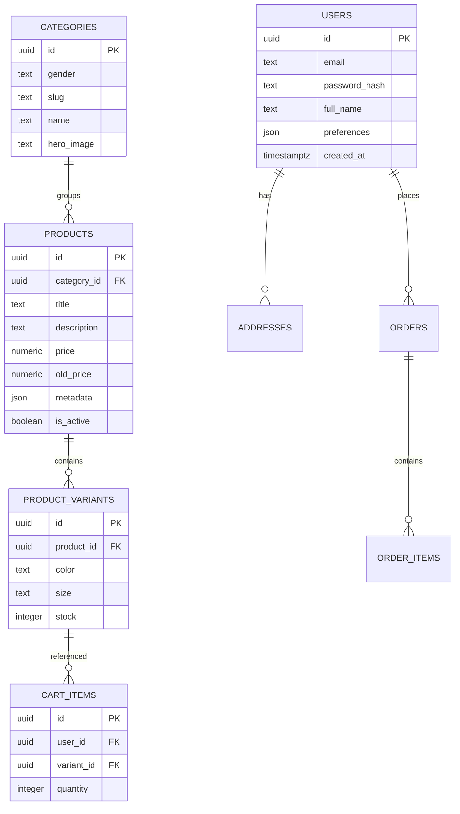

# Becca Giyim Backend Taslak Planı

## 1. Amaç ve Kapsam
- React tabanlı mevcut frontend'i destekleyecek REST API/GraphQL servisi.
- Ürün, kategori, kullanıcı, sipariş ve sepet uç noktaları.
- Yönetim paneli/entegre CMS ile içerik ve stok yönetimi.

## 2. Teknoloji Seçimi
| Katman | Önerilen Teknolojiler |
| --- | --- |
| Uygulama Sunucusu | Node.js (18+), Express.js veya Fastify |
| Veritabanı | PostgreSQL (Supabase/Postgres) |
| ORM/ODM | Prisma veya TypeORM |
| Kimlik Doğrulama | Supabase Auth, JWT tabanlı oturum |
| Depolama | Supabase Storage veya S3 uyumlu servis |
| Kuyruk/SMS | (İleride) BullMQ + Redis |

## 3. Mimari Bileşenler
1. **API Gateway / Server**: Express tabanlı REST katmanı.
2. **Database Layer**: Prisma ile Postgres. Migration yönetimi için Prisma Migrate veya Supabase CLI.
3. **Authentication & Authorization**:
   - Email/password, magic link ve sosyal giriş destekli Supabase Auth.
   - RLS (Row Level Security) ile kullanıcı verilerini izole et.
4. **Caching**: Redis ile hot data (ana sayfa ürünleri, kategori listeleri).
5. **File Storage**: Ürün görselleri için Supabase Storage bucket.
6. **CI/CD**: GitHub Actions -> Railway/Supabase Edge Functions deploy pipeline.

## 4. Veri Modeli Taslağı

## 5. API Endpoint Taslağı
| Method | Endpoint | Açıklama |
| --- | --- | --- |
| GET | `/api/categories` | Kadın/Erkek ve alt kategorileri listeler |
| GET | `/api/products` | Query parametreleriyle filtreleme/sıralama |
| GET | `/api/products/:id` | Ürün + varyant detayları |
| POST | `/api/cart` | Sepete ürün ekler (auth zorunlu) |
| PATCH | `/api/cart/:itemId` | Adet güncelleme |
| DELETE | `/api/cart/:itemId` | Sepetten çıkarma |
| POST | `/api/checkout` | Sipariş oluşturma (teslimat/ödeme bilgisi alır) |
| GET | `/api/orders` | Kullanıcı sipariş geçmişi |
| GET | `/api/orders/:id` | Sipariş detayları |
| POST | `/api/auth/login` | JWT oturumu başlatır |
| POST | `/api/auth/register` | Yeni kullanıcı |

## 6. Checkout Akışı
1. Frontend sepeti doğrular -> `/api/checkout`.
2. Adres + ödeme yöntemi payload olarak gönderilir.
3. API stok kontrolü yapar, ödeme sağlayıcısıyla (Stripe/Iyzico) konuşur.
4. Başarılı olursa `orders`, `order_items` kayıtları oluşturulur, stok düşülür.
5. Kullanıcıya e-posta gönderilir.

## 7. Yönetim Paneli (MVP)
- `/admin` route'u, Next.js veya ayrı React uygulaması.
- Ürün CRUD, stok güncelleme, sipariş yönetimi.
- Role-based access (admin/editor).

## 8. İzleme ve Loglama
- Supabase Log Drains + Logflare.
- Sentry ile hata izleme.
- Performance metricleri için OpenTelemetry entegrasyonu opsiyonel.

## 9. Yol Haritası
1. **Sprint 1**: Auth, Category, Product endpointleri + DB modelleri.
2. **Sprint 2**: Cart, Checkout ve Order servisleri.
3. **Sprint 3**: Admin paneli ve içerik yönetimi.
4. **Sprint 4**: Observability, caching, optimize edilmiş sorgular.

## 10. Supabase Kullanımı
- Proje oluştur: `supabase projects create becca-giyim`.
- `supabase db push` ile Prisma şemasını uygula.
- Storage bucket: `products` klasörü, RLS politikası sadece admin yükleme.
- Edge Functions: kampanya hesaplama, stok senkronizasyonu.

Bu plan, frontend geliştirmesi tamamlanırken backend için paralel bir yol haritası sunar. Bir sonraki adım, Prisma şema dosyası ve migration taslaklarının oluşturulmasıdır.
